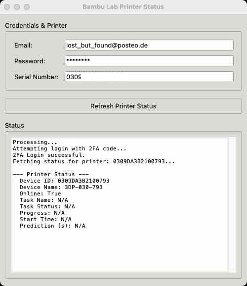

# Bambu Lab Cloud Printer Status Viewer

This project provides tools to check the status of your Bambu Lab 3D printer via the cloud API. It supports logins requiring Two-Factor Authentication (2FA).



It includes:
1.  A command-line interface (CLI) tool: `bambu_cli.py`
2.  A graphical user interface (GUI) tool: `bambu_gui.py`

The API interaction logic is primarily encapsulated in `bambu_cli.py`'s `BambuClient` class, which is utilized by both the CLI and GUI frontends.

## Features

*   Login to Bambu Lab cloud account.
*   Handles 2FA (verification code) if required by the account.
*   Fetches and displays the status of a specified printer by its serial number.
*   **Secure Session Management**:
    *   **CLI**: Automatically saves and reuses your login session (access token) securely using the system's keyring (e.g., macOS Keychain, Windows Credential Manager, Linux Secret Service). This significantly reduces the need for repeated password and 2FA entries.
    *   **GUI**: Offers secure saving of both login credentials (email, password, serial) and the login session (access token) using the system's keyring. Provides a checkbox to manage this preference.
*   Provides both CLI and Tkinter-based GUI interfaces.

## Project Structure

```
.
├── bambu_cli.py        # Backend logic and Command Line Interface
├── bambu_gui.py        # Tkinter Graphical User Interface
├── requirements.txt    # Python dependencies
└── README.md           # This file
```

## Setup

1.  **Clone the repository (if you haven't already):**
    ```bash
    git clone <repository-url>
    cd <repository-directory>
    ```

2.  **Create a virtual environment (recommended):**
    ```bash
    python -m venv venv
    source venv/bin/activate  # On Windows: venv\Scripts\activate
    ```

3.  **Install dependencies:**
    ```bash
    pip install -r requirements.txt
    ```
    This will install `requests` (for API calls), `python-dotenv` (for optional .env file usage, though less critical now), and `keyring` (for secure credential and session storage). Tkinter is part of the Python standard library.

## Usage

You will need your Bambu Lab account email, password, and the serial number of the printer you want to query. The serial number is often referred to as `dev_id` in the API responses.

### 1. Command-Line Interface (CLI)

The CLI tool `bambu_cli.py` allows you to fetch printer status directly from your terminal.

**Syntax:**

```bash
python bambu_cli.py <your_email> <printer_serial_number> [-p <your_password>]
```

*   `<your_email>`: Your Bambu Lab account email address. (Can be omitted if a session is already saved or when using `--logout` if a previous session email is known).
*   `<printer_serial_number>`: The serial number of your printer. (Can be omitted when using `--logout`).
*   `[-p <your_password>]`: Optional. If you omit the password, and no valid session exists, you will be prompted to enter it securely.
*   `[--logout]`: Optional. Clears any saved session token for the specified email (or the last used session email if no email is provided).

**Session Management (CLI):**

The CLI tool now automatically saves your login session (access token) to your system's keyring after a successful login. On subsequent runs for the same email:
*   It will attempt to use the saved session token, bypassing the need for password and 2FA code entry.
*   If the saved token is invalid or expired, it will automatically clear it and prompt you to log in again with your password (and 2FA if applicable). The new session will then be saved.
*   You will see messages like "Loaded saved CLI session token." or "Session token saved."

**Examples:**

*   **Provide password as an argument:**
    ```bash
    python bambu_cli.py myemail@example.com 00M00AXXXXXXXXXX -p MySecurePassword123
    ```

*   **Prompt for password (more secure):**
    ```bash
    python bambu_cli.py myemail@example.com 00M00AXXXXXXXXXX
    ```
    You will then be asked: `Enter password for myemail@example.com:` (if no valid session token is found).

*   **Logout (clear saved session for an email):**
    ```bash
    python bambu_cli.py myemail@example.com --logout
    ```
    Or, to clear the last used session if email is not provided:
    ```bash
    python bambu_cli.py --logout
    ```

**2FA Handling (CLI):**
If your account requires 2FA and you are performing a fresh login (no valid session token):
*   The script will first attempt to log in with your email and password.
*   If the API indicates a verification code is needed, you will be prompted:
    `Login requires 2FA verification code.`
    `Enter your 2FA verification code:`
*   Enter the code sent to you (typically via email from Bambu Lab) to complete the login. The successful session will then be saved.

### 2. Graphical User Interface (GUI)

The GUI tool `bambu_gui.py` provides a user-friendly way to perform the same actions.

**How to run:**

```bash
python bambu_gui.py
```

**Using the GUI:**

1.  **Launch the application:** `python bambu_gui.py`
2.  **Initial Launch & Session Loading:**
    *   The application will attempt to load a saved session (access token) from your system's keyring.
    *   If a valid session is found for a previously used email:
        *   The email and serial (if saved) fields will be populated.
        *   Password field will be empty and disabled. Other fields also disabled.
        *   The status area will indicate "Verifying saved session..." and automatically attempt to fetch printer status.
        *   If successful, the UI will be ready for refreshing status.
    *   If no session is found, or if a saved session is invalid:
        *   Fields for Email, Password, and Serial Number will be active.
3.  **Login:**
    *   Enter your **Email**, **Password**, and **Printer Serial Number**.
    *   **"Save Credentials Securely" Checkbox:**
        *   **Checked**: If you check this box, your Email, Password (the one you enter), and Serial Number will be saved to the system keyring upon a successful login. The login session (access token) will also be saved. On future launches, these details will be auto-filled (password field will remain populated but disabled if session is active), and the session token will be used.
        *   **Unchecked**: Only the login session (access token) will be saved to the keyring upon successful login. Email, Password, and Serial are not stored. You'll need to re-enter them if the session expires or is cleared, but not if the session token remains valid for the next launch.
    *   Click **"Get Printer Status"**.
4.  **Status Messages & 2FA:**
    *   The text area will display login progress.
    *   If 2FA is required, a "2FA Code" field will appear. Enter the code and click "Login with 2FA Code".
    *   Success/failure messages and printer status will be displayed.
5.  **Post-Login / Active Session:**
    *   The button changes to **"Refresh Printer Status"**.
    *   If a session was loaded from keyring or established via login:
        *   Email and Serial fields are typically disabled.
        *   Password field is disabled and usually cleared (if session is active).
6.  **Clearing Saved Data:**
    *   If you uncheck "Save Credentials Securely" *after* it was previously checked and data was saved, all stored credentials (Email, Password, Serial) AND the saved session token will be cleared from the keyring. The UI will reset to allow fresh login.

## Sample Output

When running the tool, you may see output like the following (with a real serial number, e.g., 0309**************):

```
Processing...
Attempting login with 2FA code...
2FA Login successful.
Fetching status for printer: 0309**************...

--- Printer Status ---
  Device ID: 0309**************
  Device Name: 3DP-030-793
  Online: True
  Task Name: N/A
  Task Status: N/A
  Progress: N/A
  Start Time: N/A
  Prediction (s): N/A
```

The serial number (Device ID) will match the one you provide in your `.env` or as a command-line argument.

## API Reference

The underlying API calls are based on information from:
*   [Gist: fdenzer/0db25396c131b42f14bfcc8d69f1faf8](https://gist.github.com/fdenzer/0db25396c131b42f14bfcc8d69f1faf8)

Key endpoints used:
*   Login: `POST https://api.bambulab.com/v1/user-service/user/login`
*   Get Printer Status: `GET https://api.bambulab.com/v1/iot-service/api/user/print?force=true` (requires Bearer token)

## Contributing
(Placeholder for contribution guidelines if this were a larger project)

## License
(Placeholder - assuming MIT based on typical GitHub projects, but refers to LICENSE file if present)
This project is licensed under the terms of the LICENSE file.

## Debugging

**API Logging:**
For debugging purposes, both the CLI and GUI tools now automatically log all API requests and their full responses.
*   **Log Files:** These logs are saved to files named `bambu_api_log_YYYYMMDD_HHMMSS.txt` in the directory from which the script is run.
*   **Content:** Logs include the request URL, redacted headers (Authorization token is not shown), request parameters/body, response status code, response headers, and the full response body (JSON or raw text).
*   **Purpose:** This is intended to help diagnose issues with API communication or unexpected responses from the Bambu Lab cloud service.
*   **Sensitivity:** Please be aware that these logs will contain your device ID and other non-credential details related to your printer and account. Do not share these logs publicly if you are concerned about this information. The access token itself is redacted from the logged headers.
*   **GUI Notification:** The GUI application will show a message in its log panel upon startup, reminding you that API logging is active.
